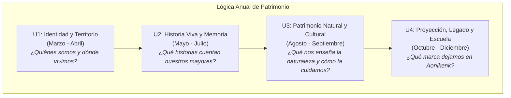

# 🗺️ Mapa Curricular: Taller de Patrimonio 2026
**Enfoque:** Identidad cultural local y huerto escolar

### Hitos y Productos
- **Identidad y Territorio**: Bitácora inicial y mapa de la comunidad escolar. (Hito: Día de los Patrimonios (Mayo))
- **Historia Viva y Memoria**: Exposición de registros fotográficos y narrativas cortas. (Hito: We Tripantu (Junio))
- **Patrimonio Natural y Cultural**: Herbario patrimonial o diario del huerto. (Hito: Activación del Aula-Huerto)
- **Proyección, Legado y Escuela**: Intervención artística en la escuela y cierre de bitácora fotográfica. (Hito: Aniversario Escuela (Octubre) y Muestra Final)
