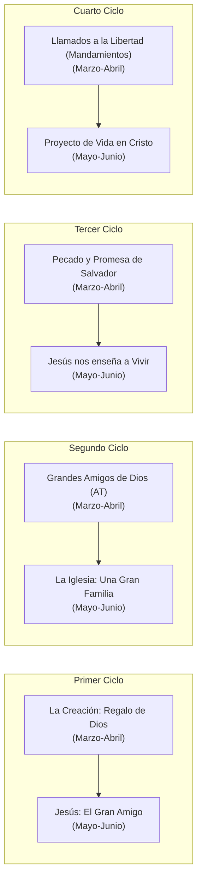

# 🗺️ Mapa Curricular: Religión Católica 2026
**Enfoque:** Formación integral, reflexión filosófica y conexión vida-fe (MBE)

```mermaid
graph LR
    subgraph "Primer Ciclo"
        r1["La Creación: Regalo de Dios<br/>(Marzo-Abril)"]
        r2["Jesús: El Gran Amigo<br/>(Mayo-Junio)"]
        r1 --> r2
    end
    subgraph "Segundo Ciclo"
        r3["Grandes Amigos de Dios (AT)<br/>(Marzo-Abril)"]
        r4["La Iglesia: Una Gran Familia<br/>(Mayo-Junio)"]
        r3 --> r4
    end
    subgraph "Tercer Ciclo"
        r5["Pecado y Promesa de Salvador<br/>(Marzo-Abril)"]
        r6["Jesús nos enseña a Vivir<br/>(Mayo-Junio)"]
        r5 --> r6
    end
    subgraph "Cuarto Ciclo"
        r7["Llamados a la Libertad (Mandamientos)<br/>(Marzo-Abril)"]
        r8["Proyecto de Vida en Cristo<br/>(Mayo-Junio)"]
        r7 --> r8
    end
```
